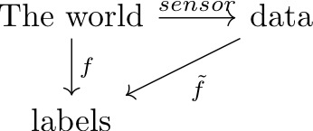

# Contents
- Data-science in a nutshell
- Where are we?
- Where should we go?
- How do we get there?
---
# Data-science in a nutshell
We have data that we want labelled.

---
# Where are we?
 - We can semi-reliably detect bad lifts in a warehouse environment if it's worn on the correct side.
 - We can detect walking pretty well.
 - We can detect squat, but only if the squat generates a lift-window.

---
# Where should we go?
- We should know our ground truth
- Step counter
- ROI calculator
- We should get rid of Our caveats (e.g. "semi-reliable", "but only if ..", "correct side")
---

# Ground truth
- **We need:**
  - a quick way to annotate data
  - data to annotate
- **Solution:**
  - For annotation we will probably use [scale-api](https://www.scaleapi.com/)
  - For back-angle annotation we might use some [computer vision](https://www.youtube.com/watch?v=tKfkGttx0qs)
  - Data will be gathered by myself and/or by an intern.

---
## Side detection
- for a quick-dirty side detector, we can rock-and-roll today.
  - I'd give this one sprint, and then table it if things don't work out.
- To do it well we need:
  - better walking annotation
  - Videos annotated with the location of the device.

---
## Step counter
- **We need:**
  - data of walking, with known step counts. (we have a few videos)
  - to test the existing algorithm
  - to write a new algorithm if the existing one doesn't cut it.

---
## ROI calculator
- **We need:**
  - An accurate estimate of back-angle
  - A squat estimator that works independently of lift-windows.

---
## Other stuff
It's hard to plan ahead until we get a ground truth:
- Anomaly detection
- location detection
- More accurate back-angle calculations (it never buzzes for Matt)
- A more useful coruscant-report
- replace kinetic-live with plotly
- a walk detector with less lag
- transition to using embedded tensorflow
